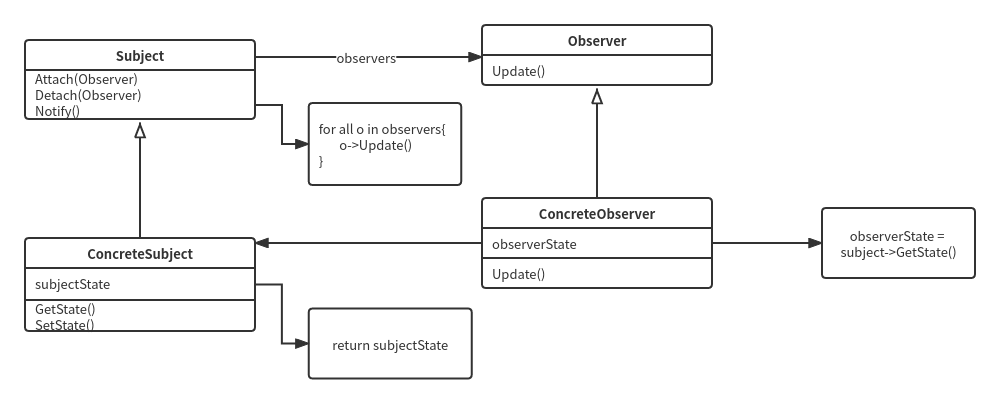
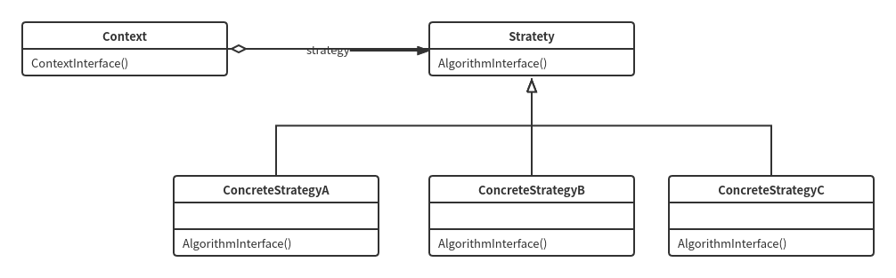

## 一看就懂的最核心最精简的设计模式

### 创建型：抽象了实例化过程

### 结构型：涉及到如何组合 （类和对象）以获得更大的结构（类和对象 组合 出更大的结构）

- proxy（代理模式）：使用实际物体的指针并包装（或说代理、或说封装）它的方法，并且与实际物体是同一类型（继承同一个基类）**（结构型有点包装一个类，组合一个类的意思，这样可以获得更大的结构）**
  - 结构
  - 使用场景：扩展点在无穷尽的包装实际物体方法，隐藏掉实际物体
  - 最精简最核心代码（复制粘贴即可用）

### 行为型：涉及到 算法和对象间 职责 的分配（算法和对象间，负责啥，之间好的分配）

- chain of responsibility（责任链） : 将对象连成一条链，并沿着这条链传递该请求，直到有一个对象处理它为止（核心要义）**(行为型的设计模式是不是有点责任分离的意思)**

  - **重点在个链字（用链分离责任）**
  - 结构（核心且最精简的示意图）：

    
  - 一个典型的对象结构可能如下图所示：

    
  - 使用场景：扩展点在于无穷尽个链节点（链子类）
  - 最精简最核心的代码（复制粘贴即可用）:
  
- command（命令模式） ：命令作为中间类(包装接受者)、可以扩展很多命令，隔离掉接受者(接受者才是真正处理请求的各种sao操作)，从而使得你可以包装出各种请求者的请求（核心要义）**(行为型的设计模式是不是有点责任分离的意思)**

  - 重点在于**命令作为中间类(包装接受者)、可以扩展很多命令，并隔离掉接受者（用命令类分离具体执行操作的接受者）**
  - 结构（核心且最精简的示意图）：
  - 使用场景：扩展点在于无穷尽个命令子类
  - 最精简最核心的代码（复制粘贴即可用）:
  
- interpreter（解释器模式）：翻译器（翻译要重点理解），**递归般的判断的**去翻译一个句子，**翻译的语法做隔离**，核心点是**递归般的判断的** 和 **翻译的语法隔离**，翻译的语法可以扩展很多种（核心要义）**(行为型的设计模式是不是有点责任分离的意思)**

  - 结构（核心且最精简的示意图）：
  - 使用场景：重复发生的事情可以用解释器模式(日志分析)，一个简单语法需要解释的场景
    - 优点：是一个简单的语法分析工具，扩展性良好，修改语法只需要修改相对应的非终结符表达式就可以了，扩展语法只需要增加非终结符类即可
    - 缺点：解释器引起类膨胀，采用递归的调用方式，效率问题，循环和引用太多
  - 最精简最核心的代码（复制粘贴即可用）:
  
- iterator（迭代器模式）：**(行为型的设计模式是不是有点责任分离的意思)**

  - 迭代器模式全篇设计的核心点是 容器 和 迭代器 各自负责 的内容分离
  - 代码编写的核心点在于 容器的父类（很多必须设计的点） 和 迭代器的父类
  - 迭代器责任：使用容器的指针 并负责访问容器元素，也就是访问容器元素 get
    - 迭代器父类：给出接口
    - 迭代器子类：实现接口
  
- - 容器责任：装配具体类型，比如int，并进行 push， pop 等操作
    - 容器的父类：负责分配内存
    - 容器子类：负责构造对象
  
- observer(观察者模式): 无穷多个观察者观察同一个目标, 当目标发生变化, 无穷多个观察者就会收到通知

  - 结构（核心且最精简的示意图）:
    - 
  - 使用场景：订阅通知，扩展点在于无穷尽个观察者类
  - 最精简最核心的代码（复制粘贴即可用）
  
- strategy(策略型): 定义一系列算法把他们一个个封装起来（隔离开），并使得他们可以互相替换（核心：隔离开，可替换）**(行为型的设计模式是不是有点责任分离的意思)**

  - 结构：

    

  - 使用场景：各种算法分离开，扩展点在于无穷尽个算法子类

  - 最精简最核心代码（复制粘贴即可用）

- template method（模板方法）：定义算法骨架（抽象的原语操作），将操作（或实现）延迟（也可以说推给）子类（具体的子类实现算法个一个个步骤）

  - 结构
  - 使用场景：算法框架，扩展点在可以有无穷尽个算法的方法
  - 最精简最核心代码（复制粘贴即可用）

### ubuntu编译测试指令例子：

```
g++ -o test chain_of_responsibility.cpp --std=c++11
```

### git 地址

```
git clone https://hub.fastgit.org/mingo-wu1/gof_design_pattern_23.git
```
